# Libertas Hub Raspberry Pi Images

This repository contains the Libertas Hub release for Raspberry Pi 2, Raspberry Pi 3, and Raspberry Pi 4.

## What is Libertas Hub?

Libertas Hub is an **IoT** (Internet of Things) central controller with an IoT App design, **Thing-App**.

Libertas Hub connects to other IoT devices and enables end-users to run Thing-App to interact with those devices.

Libertas Thing-App is "write once, run everywhere" written in TypeScript. Our goal is to enable trillions of devices to run Thing-App directly. Libertas Hub is the first and most important step.

Libertas is designed to reach **billions** of users and cover **trillions** of CPU/MCU chips. With its simple yet disruptive design, We are confident Libertas will lead in the following decades.

## Prepare the hardware.

You will need:
1. A Raspberry Pi 2, 3, or 4 board.
2. A microSD card as main storage. A size of >= 16GB is recommended; 8 GB is the minimum.
3. A [nRF52840 Dongle](https://www.nordicsemi.com/Products/Development-hardware/nrf52840-dongle). It costs about USD 10.
4. A USB thumb drive as backup storage. The Hub must have dual storage backup. Also, the thumb drive is IoT data storage.

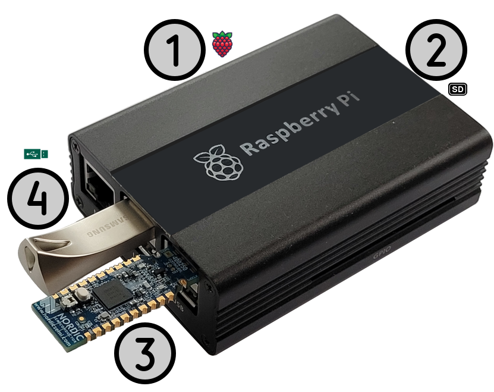

## Download the zip file and extract

Get the zip file for your Raspberry Pi model from the [latest release (https://github.com/LibertasIoT/libertas-rpi-img/releases)](https://github.com/LibertasIoT/libertas-rpi-img/releases) and extract the zip file.

## Prepare the nRF52840 dongle

The nRF52840 Dongle is required as a radio transceiver. Use the nRF tool below to program Hornet transceiver firmware into the dongle.

### Download nRF Connect Desktop

Follow this link ([https://www.nordicsemi.com/Products/Development-tools/nrf-connect-for-desktop](https://www.nordicsemi.com/Products/Development-tools/nrf-connect-for-desktop)). 

The download link is on the left side of the webpage.

Install the software. Then launch the software. Note that we only need the "programmer App," as shown in the screenshot below.

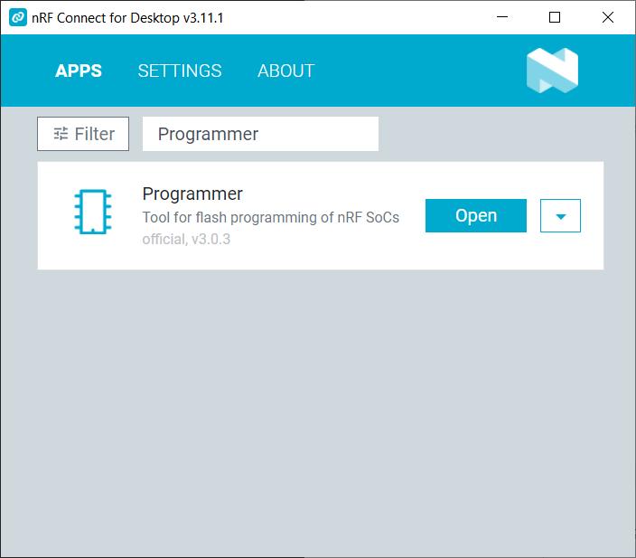

### Program transceiver firmware

#### Use the NRF programmer

First, click the "Add file" button in the upper left part of the window. Next, choose the .img file that comes with the zip file. The file name should be:

**```nrf52840-transceiver.img.hex```**

Then plug the dongle into the USB port of the machine. Wait for a few seconds. There should be a "USB plug-in sound" on the Windows platform. 

Press the "horizontal button" on the dongle, as shown in the picture below. The dongle shall be in programming mode.

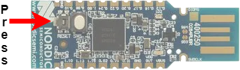

Then choose the dongle from the "SELECT DEVICE" button on the uppermost left side.

The correct device shall be an "Open DFU bootloader."

As the last step, click the "write" button on the left, and wait for the writing progress to finish.

Please note that, as long as you see something like below, the write is successful!

```
HH:MM:SS.sss Uploading image through SDFU: 100%
HH:MM:SS.sss All dfu images have been written to the target device
```

An error message as shown below may follow immediately due to dongle reboot. Just ignore it!

```
HH:MM:SS.sss Target device closed
HH:MM:SS.sss Failed to write: Error: Timeout while waiting for device XXXXXXXXXXXX to be attached and enumerated
```

Unplug the dongle and plug it into a USB port of the Raspberry Pi. It is OK to use a USB 1.1 or 2.0 port.

There is a button on the dongle. Please ensure you can still access the button while the dongle is plugged into the Raspberry Pi. During Hub admin processes, you may be asked to press the button to prove that you have physical access to the Hub.

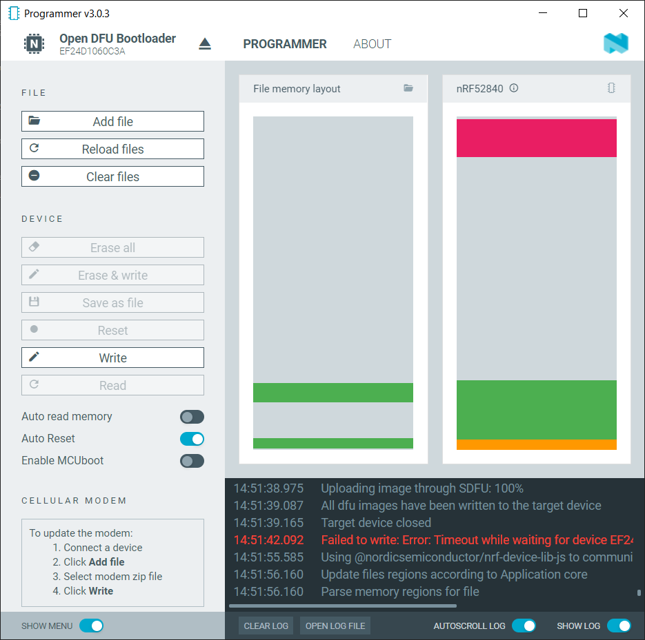

## Prepare the microSD card

It is recommended to use Rufus to write to a microSD card. You can download Rufus from [https://rufus.ie/](https://rufus.ie/).

Choose the microSD card and the Raspberry Pi image. Leave all other parameters with their default values and click START to initiate the writing process. The image file shall be something like the below,

**``` libertas-raspberrypiN_2022XXXXXXXXXX_fullsd.img ```**

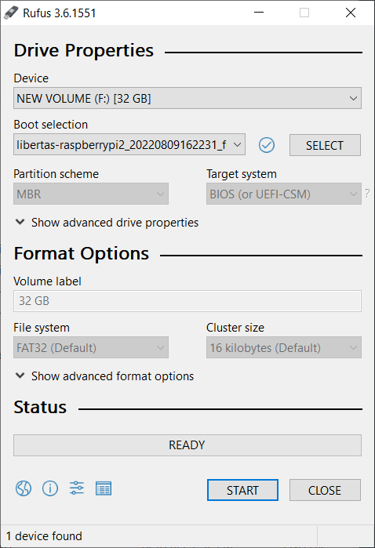

Two warning dialogs may pop up. 

Press "OK" on each dialog to proceed.

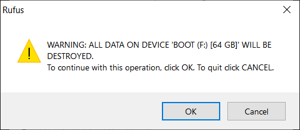 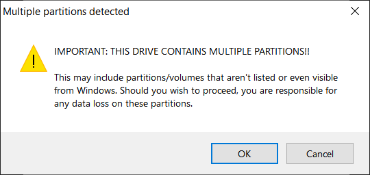

Once Rufus is done writing the micro SD card. Remove the card from the PC and plug it into your Raspberry Pi. 

Make sure the nRF52840 Dongle and USB drive are also plugged in. Then power up your Pi.

## Smartphone App

iOS App is always 10% behind and it is not released yet.

Follow the linkes below to download Android App.

<a href="https://play.google.com/store/apps/details?id=com.smartonlabs.qwha"></a>

<a href="amzn://apps/android?asin=B085XQBZN1"></a>

<a href="https://librehome.com/app-release.apk">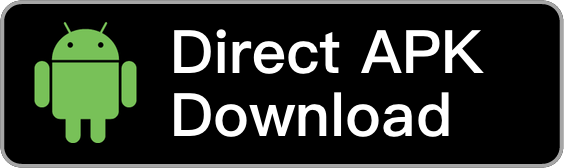</a>

## Setup the Hub

Follow this instruction to set up the Hub using Libertas Android App.

[https://librehome.com/doc/smartphone_app/managing_hubs/add_a_new_hub/](https://librehome.com/doc/smartphone_app/managing_hubs/add_a_new_hub/)

Note that Raspberry Pi Hub will not be able to use our bridge service. Instead, you will need to set up the dynamic DNS and NAT to access the Hub from the Internet through our Libertas Smartphone App.

## Access Libertas IoT Studio IDE

[Every Libertas IoT Hub comes with Libertas-IoT Studio, a complete development IDE that is free for everybody.](https://librehome.com/doc/developers_doc/development_tool/)

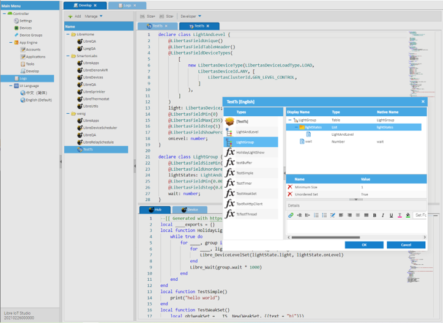

## What Can I do With the Libertas Hub?

The Libertas Hub currently supports Hornet Mesh wireless technology. In addition, it works with [9 Libertas smart home devices](https://librehome.com) now.

What about Google's Thread and Matter technology? Well, since Matter is IP based. The Hub can support it right now. Nevertheless, for now, in Libertas, Matter is just a Thing-App!

Libertas has a bigger plan. We want every device to have a Thing-App virtual machine and to interact with other devices independently, securely, and privately. 

Moreover, we are working to open source complete code for different MCUs, the Hornet Cluster Library.

* Hornet Cluster Library will have a built-in Thing-App engine (a Lua VM).
* Hornet Cluster Library will hide the underlying details about the wireless stack (Thread/Matter, Hornet, or other protocols)
* Hornet Cluster Library will significantly simplify the development of device/sensor firmware. It will usually take a few dozen lines of code for a device.

[As for Hornet, why another mesh network technology? If Thread works, then we are glad someone else is taking responsibility. However, we are concerned about the stability and not being truly open about the whole Thread/Matter thing.](https://librehome.com/doc/hornet_doc/index.html#why-another-mesh-protocol)

## Architecture of MCU side system

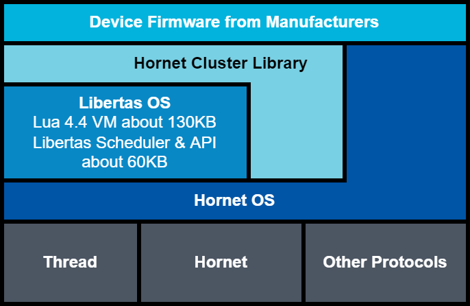

Libertas is many years ahead. We laid the foundation of both interconnectivity and interactivity. It is more about the IoT intelligence layer than simple connectivity. Plus, when they say "connectivity," it does not necessarily mean **inter**connectivity!

## More on Thing-App

The innovation of Libertas is Thing-App, the application for IoT. We can mathematically prove that Libertas' design brings optimal experience to end-users and application developers.

For end-users, the design is simple three steps. 1. Choose a Thing-App from our Thing-App store; 2. Throw things into the Thing-App, possibly with some extra parameters; 3. Start the Thing-App.

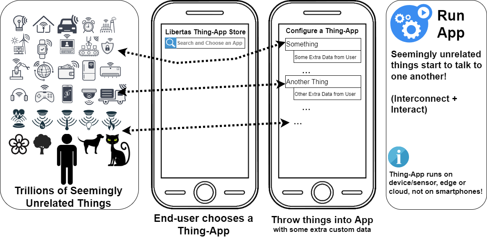

For developers, the design can not be more straightforward. First, the developer decides what type of things and extra parameters are needed for their Thing-App. The developer must then design a tree structure for those things and parameters. Next, the developer declares the tree structure as a few classes in the source code. At last, the developer writes a function as a process with necessary arguments.

The Libertas IDE (web-based builtin with the Hub) will analyze type declarations in source code and automatically generate the UI on a smartphone for a user to create the tree data based on the type declarations.

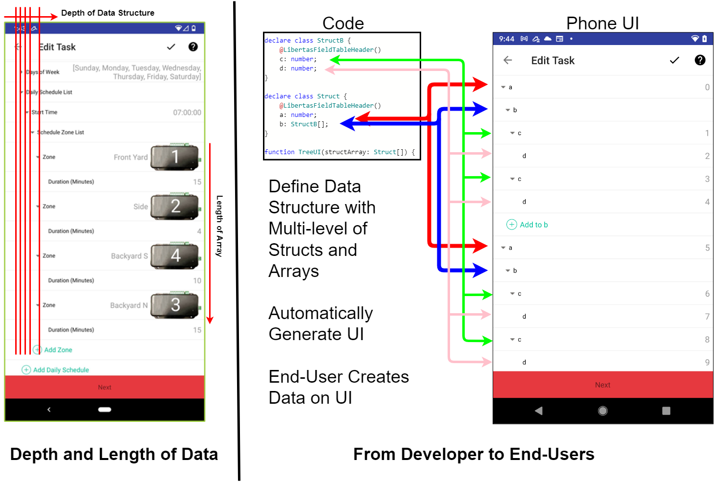

### Additional technical documentations

Follow the link below to read the technical overview slides.

[https://docs.google.com/presentation/d/1oxe2K6-h2BWhlbm56ZZ4ZNBXoStRQs_iNyDqhWXge3w](https://docs.google.com/presentation/d/1oxe2K6-h2BWhlbm56ZZ4ZNBXoStRQs_iNyDqhWXge3w).

Follow the link below to read the developer guides.

[https://librehome.com/doc/developers_doc](https://librehome.com/doc/developers_doc)

Follow the link below for the latest up-to-date API documentation.

[librehome.com/api/modules/libertas.html](librehome.com/api/modules/libertas.html)

Libertas is a general-purpose IoT platform with two operating systems, not just for smart homes!

### Tutorials

While we will open-source the complete code for MCUs later,  there is plenty you can do with Libertas Hub. For example, you can start experimenting with App development, go through the tutorial code, and code for existing Apps, such as "Demon A/V receiver driver."

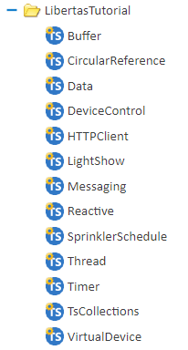

### Denon/Marantz A/V receiver driver

Another smart home example one can look at is the Denon/Marantz A/V receiver driver App. The end-user throws a receiver into the App during configuration (automatically discovered in the local network if it exists), and several "virtual devices" will be automatically created.

End users can control their receivers using our standard UI with our smartphone App. A few clicks can bind the controls to real buttons such as Libertas remote control. Furthermore, those virtual devices can be controlled with other Apps just like real devices.

It works much better than the official App on smartphones! [Here is the source code](https://github.com/librehome/librehome/blob/main/SmartonLabs/LibertasDenonAVR.ts) if you do not want to try Hub for now.

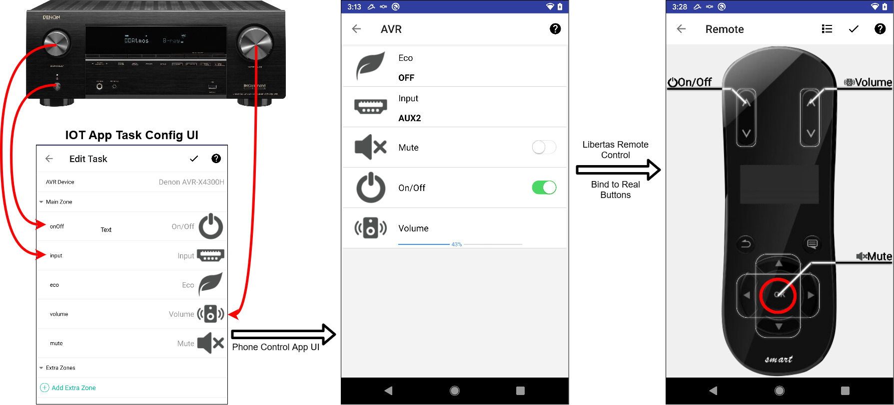

## Commercialization

Current versions of Libertas Hub are free for individuals. However, we plan a license charge starting from a future release.

Whatever the plan is, it is going to be simple. Libertas end-users shall enjoy total control, zero information leaks, and be free from stealing, robbing, and Ponzi Schemes.

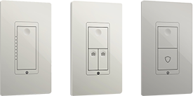 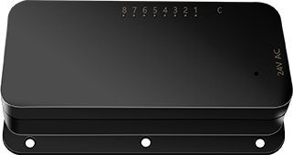 

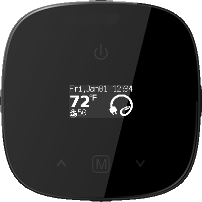 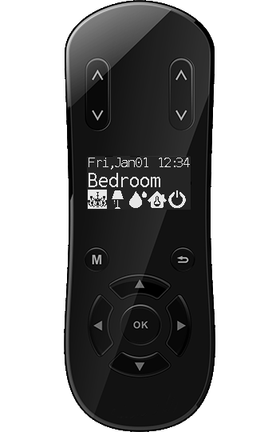 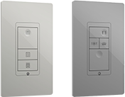 

 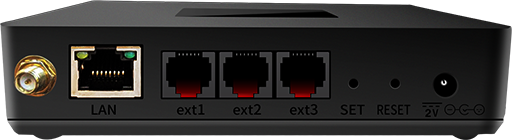 
