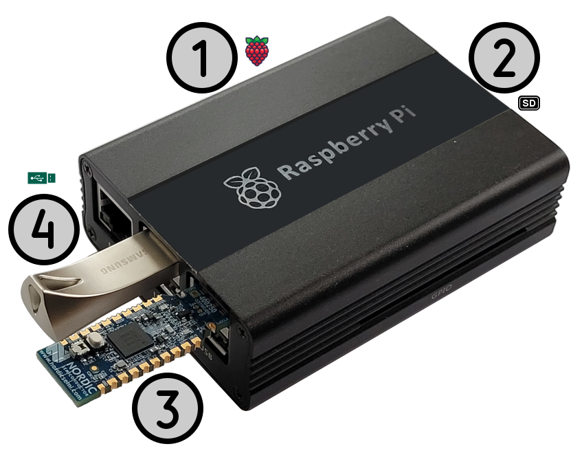
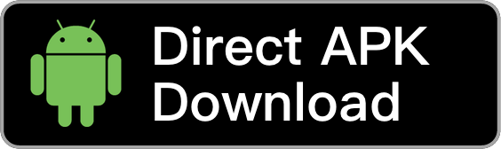

# Libertas Hub Raspberry Pi Images<br/>
Powered by [Libertas OS](https://docs.smartonlabs.com/developers_doc/libertas_os/)

## This product is *not certified with any standard body, including but not limited to Matter and Thread*. The product shall not be used for any production purpose. It shall only be used to evaluate the Smartonlabs technology.

## What is Libertas Hub?

Read the following documents:

- [Libertas Thing-App](https://docs.smartonlabs.com/developers_doc/libertas_thing_app/)
- [Libertas Hub](https://docs.smartonlabs.com/developers_doc/libertas_hub/)

## Prepare the hardware.

You will need:
1. A Raspberry Pi 2, 3, 4 or 5 board.
2. A microSD card as main storage. A size of 16GB or greater is recommended; 8GB is the minimum.
3. A [nRF52840 Dongle](https://www.nordicsemi.com/Products/Development-hardware/nrf52840-dongle). It costs about USD 10.
4. A USB thumb drive as backup storage. **The Hub must have dual storage backup**. Additionally, the thumb drive serves as a storage device for IoT data.



## Download the ZST file and extract

Get the zst file for your Raspberry Pi model from the [latest release (https://github.com/LibertasIoT/libertas-rpi-img/releases)](https://github.com/LibertasIoT/libertas-rpi-img/releases) and extract the zst file (Zstd compression).

## Prepare the nRF52840 dongle

The nRF52840 Dongle is required as a radio transceiver. Use the nRF tool below to program Hornet transceiver firmware into the dongle.

Note that other dongle hardware also works, e.g., [ESP32-S2](https://docs.espressif.com/projects/esp-idf/en/stable/esp32s2/api-guides/openthread.html). Check the vendor documentation for information on building and flashing.

### Download nRF Connect Desktop

Follow this link ([https://www.nordicsemi.com/Products/Development-tools/nrf-connect-for-desktop](https://www.nordicsemi.com/Products/Development-tools/nrf-connect-for-desktop)). 

The download link is on the left side of the webpage.

Install the software. Then, launch the software. Note that we only need the "programmer App," as shown in the screenshot below.


### Program RCP firmware

#### Use the NRF programmer

First, click the "Add file" button in the upper left part of the window. Next, select the .img file included in the zip file. The file name should be:

**```nrf52840_rcp_20250402.hex```**

Then, plug the dongle into the USB port of the machine. Wait for a few seconds. There should be a "USB plug-in sound" on the Windows platform. 

Press the "reset button" on the dongle. The button press shall be horizontal to the PCB board, as shown in the picture below. The dongle shall be in programming mode.


Then, choose the dongle from the "SELECT DEVICE" button located on the upper left side.

The correct device shall be an "Open DFU bootloader."

As the final step, click the "Write" button on the left and wait for the writing progress to complete.

Make sure the write operation is successful.

Unplug the dongle and plug it into a USB port of the Raspberry Pi. It is OK to use a USB 1.1 or 2.0 port.


## Prepare the microSD card

It is recommended to use Rufus to write to a microSD card. You can download Rufus from [https://rufus.ie/](https://rufus.ie/).

Choose the microSD card and the Raspberry Pi image. Leave all other parameters with their default values and click START to initiate the writing process. The image file shall be something like the below,

**```libertas-raspberrypi??_2025??????????_fullsd.wic```**


Two warning dialogs may pop up. 

Press "OK" on each dialog to proceed.

 

Once Rufus is done writing the micro SD card. Remove the card from the PC and plug it into your Raspberry Pi. 

## Prepare a USB drive

Format a single partition with exFat.

**Note: The USB drive will be reformated into ext4 by Hub. All content on the drive will be lost!!!**

## Power up the Pi

**Ensure the nRF52840 Dongle and USB drive are plugged in before powering up your Pi.**

**Also, ensure the Hub's ethernet port is plugged into the local network.**

## Smartphone App

The iOS App is always 10% behind, and it has not been released yet.

Follow the links below to download the Android App.

<a href="https://play.google.com/store/apps/details?id=com.smartonlabs.qwha"></a>

<a href="https://librehome.com/app-release.apk"></a>

## Setup the Hub

Follow these instructions to set up the Hub using the Libertas Android App.

[https://docs.smartonlabs.com/smartphone_app/managing_hubs/add_a_new_hub/](https://docs.smartonlabs.com/smartphone_app/managing_hubs/add_a_new_hub/)

Powering up the Hub for the first time takes longer than usual because of the extra initialization steps, such as expanding and formatting the data partition on the SD card. Keep the "Discovery" screen open, and the Hub will appear as soon as it's ready.

Please note that the Raspberry Pi Hub will not be able to utilize our bridge service. Instead, you will need to set up the dynamic DNS and NAT to [access the Hub](https://docs.smartonlabs.com/smartphone_app/managing_hubs/hub_connection_settings/#using-static-ip) from the Internet through our Libertas Smartphone App.

### Current builds

Raspberry 2, 3, 4, and 5 images built with the latest Yocto LTS Scarthgap.

- A/B SD card partition upgrade capability
- USB drive backup
- Latest Linux 6.6 kernel
- Built-in OpenThread Border Router (OTBR)

## Access Libertas IoT Studio IDE

[Every Libertas IoT Hub comes with Libertas-IoT Studio, a complete development IDE that is free for everybody.](https://docs.smartonlabs.com/developers_doc/development_tool/)


